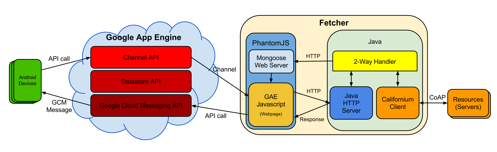

# IoTCloud - CoAP
IoT Cloud is an architecture that aims to bridge networks of CoAP constrained nodes (located in LANs) with Internet-connected clients (such as Android devices), in order to eliminate geographical restrictions without sacrificing performances.

The following scheme provides a complete view of the structure:

**DISCLAIMER**: This is the CoAP part of the project; you can find the repository about Google Cloud & Android App [here](https://github.com/MircoRosa/iotcloud-google-cloud).

An in-depth description of the entire project can be found (in Italian) on my [Thesis](docs/Thesis.pdf), [Project Summary](docs/Riassunto.pdf) and [PDF Presentation](docs/Thesis%20Presentation%20-%20PDF.pdf).

## Components
Here is a quick overview of the components designed in this part; again, for further details it is suggested to check out the documentation (in Italian) linked at the top.

### Fetcher
The component that acts as a bridge between CoAP nodes and Google Cloud. It uses PhantomJS to access the APIs provided by the Google Cloud backend, and the Californium framework for CoAP Communication: a real-time snapshot of the scenario is kept synchronized receiving notifications directly from the nodes (discovered by JmDNS), and updates are intelligently sent in batches to the Cloud.

### CoAP Nodes
CoAP Nodes' code is designed keeping in mind the real world constrained devices on which it will run, so it's minimal and easily customizable: core features such as CoAP Communication and Service Advertising are built-in, while any other desired behaviour must be implemented as needed.

##### Scenario Simulator
A scenario simulator has been created for local testing: it allows the execution of multiple clients on the same machine, which is particularly useful for a quick check of the system functionality.

## Libraries and Services Used
- [Californium](https://www.eclipse.org/californium/) - The CoAP Framework used for communication
- [PhantomJS](http://phantomjs.org/) - The headless WebKit used to interface with Cloud APIs
- [JMDNS](https://github.com/jmdns/jmdns) - The multi-cast DNS library used for Service Discovery
- [Google App Engine](https://cloud.google.com/appengine/) - The cloud service used as backend

### Special Thanks
A special thanks goes to my supervisor [Marco](https://github.com/piconem) for his support in the design and implementation of the project.

#
_This is the CoAP part of my Bachelor's Degree final project "Cloud Architectures for Communication Support in Internet of Things Scenarios" @University of Parma._